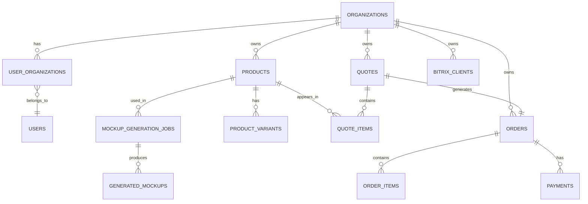

# 📚 DOCUMENTAÇÃO: Arquitetura do Sistema

**Sistema:** Gifts Store - Multi-tenant  
**Data:** 03/01/2025  
**Versão:** 1.0

---

## 🎯 VISÃO GERAL

O Gifts Store é um **sistema multi-tenant** (SaaS) para gestão de catálogos de brindes personalizados, orçamentos, pedidos e mockups gerados por IA.

### **Características Principais:**

- ✅ **Multi-tenant:** Múltiplas empresas (organizations) no mesmo banco
- ✅ **Row Level Security (RLS):** Isolamento total de dados por organization
- ✅ **Roles hierárquicos:** owner → admin → member
- ✅ **Payments:** Módulo completo de pagamentos
- ✅ **Mockups IA:** Geração de mockups com IA
- ✅ **Integrações:** Bitrix24, n8n

---

## 🏗️ ARQUITETURA GERAL

```
┌─────────────────────────────────────────────────────────────┐
│                      FRONTEND (React)                       │
│  ┌──────────────┐  ┌──────────────┐  ┌──────────────┐     │
│  │  Products    │  │   Quotes     │  │   Orders     │     │
│  └──────────────┘  └──────────────┘  └──────────────┘     │
│         ▲                  ▲                  ▲             │
│         │                  │                  │             │
│         └──────────────────┴──────────────────┘             │
│                            │                                │
│                 ┌──────────▼──────────┐                     │
│                 │  Supabase Client    │                     │
│                 │  (Auth + RLS)       │                     │
│                 └──────────┬──────────┘                     │
└────────────────────────────┼─────────────────────────────────┘
                             │
                    ┌────────▼────────┐
                    │   SUPABASE      │
                    │   (PostgreSQL)  │
                    └────────┬────────┘
                             │
        ┌────────────────────┼────────────────────┐
        │                    │                    │
   ┌────▼─────┐      ┌──────▼──────┐     ┌──────▼──────┐
   │   Auth   │      │  Database   │     │   Storage   │
   │  (JWT)   │      │  (Tables)   │     │   (Files)   │
   └──────────┘      └──────┬──────┘     └─────────────┘
                             │
                    ┌────────▼────────┐
                    │   RLS Policies  │
                    │   (Security)    │
                    └─────────────────┘
```

---

## 🗄️ MODELO DE DADOS

### **Hierarquia de Entidades:**

```
Organizations (Empresas/Tenants)
    │
    ├── Users (via user_organizations)
    │   └── Roles: owner, admin, member
    │
    ├── Products
    │   └── Product Variants
    │   └── Product Reviews
    │   └── Product Price History
    │
    ├── Quotes (Orçamentos)
    │   └── Quote Items
    │   └── Quote Comments
    │   └── Quote Versions
    │
    ├── Orders (Pedidos)
    │   └── Order Items
    │   └── Payments
    │
    ├── Clients (Bitrix24)
    │   └── Client Contacts
    │   └── Client Notes
    │
    ├── Mockup Jobs
    │   └── Generated Mockups
    │   └── Approval Links
    │
    └── Collections
        └── Collection Products
```

---

## 📊 DIAGRAMA ER (Principais Tabelas)



---

## 🔒 MODELO DE SEGURANÇA (RLS)

### **Como funciona o RLS:**

1. **User faz login** → Supabase Auth cria JWT
2. **JWT contém** `auth.uid()` (UUID do usuário)
3. **Queries SQL** passam pelo RLS
4. **Policies verificam:** User pertence à Organization?
5. **Se SIM:** Retorna dados | **Se NÃO:** Bloqueia acesso

### **Exemplo Prático:**

```sql
-- User A tenta buscar produtos
SELECT * FROM products;

-- RLS Policy executa em background:
-- "User A pertence à mesma org deste produto?"

-- Se produto.organization_id = org do User A:
--   ✅ Retorna produto
-- Caso contrário:
--   ❌ Não retorna (invisível para o user)
```

---

## 👥 MODELO DE PERMISSÕES

### **Hierarquia de Roles:**

```
owner (nível 3)
  ├─ Todas permissões de admin
  ├─ Gerenciar outros owners/admins
  ├─ Deletar organization
  └─ Ver audit logs
  
admin (nível 2)
  ├─ Todas permissões de member
  ├─ Criar/editar/deletar produtos
  ├─ Gerenciar members
  └─ Configurar integrações
  
member (nível 1)
  ├─ Ver produtos
  ├─ Criar orçamentos
  ├─ Ver clientes
  └─ Criar mockups
```

### **Matriz de Permissões:**

| Ação | Owner | Admin | Member |
|------|-------|-------|--------|
| Ver produtos | ✅ | ✅ | ✅ |
| Criar produtos | ✅ | ✅ | ❌ |
| Deletar produtos | ✅ | ✅ | ❌ |
| Criar orçamentos | ✅ | ✅ | ✅ |
| Aprovar orçamentos | ✅ | ✅ | ❌ |
| Ver clientes | ✅ | ✅ | ✅ |
| Editar clientes | ✅ | ✅ | ❌ |
| Adicionar members | ✅ | ✅ | ❌ |
| Adicionar admins | ✅ | ❌ | ❌ |
| Deletar organization | ✅ | ❌ | ❌ |

---

## 🔐 POLICIES POR CATEGORIA

### **1. User-Scoped (Dados Pessoais)**

**Tabelas:**
- user_favorites
- user_filter_presets
- saved_filters
- push_subscriptions
- notification_preferences
- product_comparisons

**Policy:**
```sql
-- Usuário vê/gerencia apenas seus próprios dados
USING (user_id = auth.uid())
WITH CHECK (user_id = auth.uid())
```

---

### **2. Organization-Scoped (Direto)**

**Tabelas:**
- products
- categories
- suppliers
- quotes
- orders
- bitrix_clients
- mockup_generation_jobs
- collections

**Policy:**
```sql
-- Usuário vê/gerencia dados da sua org
USING (public.user_is_org_member(organization_id))
WITH CHECK (public.is_org_admin(organization_id))  -- Para escrita
```

---

### **3. Organization-Scoped (Via JOIN)**

**Tabelas:**
- product_variants (herda org de products)
- quote_items (herda org de quotes)
- order_items (herda org de orders)
- payments (herda org de orders)
- product_reviews (herda org de products)
- client_contacts (herda org de bitrix_clients)

**Policy:**
```sql
-- Herda org da tabela parent
USING (
  EXISTS (
    SELECT 1 FROM public.products
    WHERE id = product_variants.product_id
      AND public.user_is_org_member(organization_id)
  )
)
```

---

### **4. Admin-Only**

**Tabelas:**
- audit_log (apenas owners)
- sync_jobs (admins+)

**Policy:**
```sql
-- Apenas admins/owners
USING (
  EXISTS (
    SELECT 1 FROM public.user_organizations
    WHERE user_id = auth.uid()
      AND role IN ('owner', 'admin')
  )
)
```

---

### **5. Public (com filtro)**

**Tabelas:**
- mockup_approval_links (público se ativo)
- notification_templates (todos autenticados)
- personalization_techniques (global)

**Policy:**
```sql
-- Público se ativo
USING (is_active = true AND expires_at > NOW())
```

---

## 🔄 FLUXO DE DADOS

### **Fluxo: Criar Produto**

```
1. User clica "Criar Produto" no frontend
   ↓
2. Frontend pega currentOrganization do context
   ↓
3. Frontend envia:
   {
     name: "Caneca",
     base_price: 15.00,
     organization_id: "uuid-da-org", // Importante!
     created_by: "uuid-do-user"
   }
   ↓
4. Supabase recebe INSERT
   ↓
5. RLS Policy verifica:
   - User pertence à organization_id? ✅
   - User é admin? ✅
   ↓
6. INSERT permitido
   ↓
7. Produto criado e retornado
   ↓
8. Frontend atualiza lista
```

---

### **Fluxo: Buscar Produtos**

```
1. Frontend chama: supabase.from('products').select('*')
   ↓
2. Supabase Auth adiciona auth.uid() ao contexto
   ↓
3. RLS Policy filtra automaticamente:
   WHERE EXISTS (
     SELECT 1 FROM user_organizations
     WHERE user_id = auth.uid()
       AND organization_id = products.organization_id
   )
   ↓
4. Retorna APENAS produtos da org do user
   ↓
5. Frontend recebe dados filtrados
   ↓
6. Zero chance de vazamento de dados!
```

---

## 🛡️ GUARD-RAILS DE SEGURANÇA

### **1. Último Owner Protection**

**Trigger:** `prevent_removing_last_owner`

```sql
-- Impede:
-- ❌ Deletar último owner
-- ❌ Downgrade último owner para admin/member

-- Permite:
-- ✅ Deletar owner se existir outro
-- ✅ Downgrade owner se existir outro
```

---

### **2. Auto-sync de Payment Status**

**Trigger:** `sync_payment_status`

```sql
-- Quando payment.status muda:
--   → orders.payment_status atualiza automaticamente
-- Garante sincronização perfeita!
```

---

### **3. Auto-atualização de updated_at**

**Trigger:** `set_updated_at`

```sql
-- Toda vez que row é atualizado:
--   → updated_at = NOW() automaticamente
-- Zero esforço manual!
```

---

## 📈 ESCALABILIDADE

### **Estratégias de Performance:**

1. **Índices Estratégicos:**
   ```sql
   -- organization_id em TODAS as tabelas org-scoped
   CREATE INDEX idx_products_org ON products(organization_id);
   CREATE INDEX idx_quotes_org ON quotes(organization_id);
   -- etc...
   ```

2. **Partial Indexes:**
   ```sql
   -- Apenas registros ativos
   CREATE INDEX idx_products_active 
   ON products(organization_id) 
   WHERE is_active = true;
   ```

3. **Composite Indexes:**
   ```sql
   -- Queries comuns
   CREATE INDEX idx_quotes_org_status 
   ON quotes(organization_id, status);
   ```

---

### **Limites Recomendados:**

| Recurso | Free Tier | Recomendado | Enterprise |
|---------|-----------|-------------|------------|
| Users/Org | 10 | 50 | Ilimitado |
| Products/Org | 100 | 1000 | Ilimitado |
| Quotes/Month | 50 | 500 | Ilimitado |
| Storage/Org | 1GB | 10GB | Ilimitado |

---

## 🔌 INTEGRAÇÕES

### **1. Bitrix24 (CRM)**

**Tabelas:**
- bitrix_clients (sync de clientes)
- bitrix_sync_log (histórico de sync)

**Fluxo:**
```
Bitrix24 Webhook
    ↓
n8n Workflow
    ↓
Supabase Edge Function
    ↓
INSERT/UPDATE bitrix_clients
    ↓
organization_id definido
    ↓
RLS garante isolamento
```

---

### **2. n8n (Automação)**

**Uso:**
- Sync com Bitrix24
- Envio de emails
- Webhooks de pagamento
- Notificações

---

### **3. Mockup Generation (IA)**

**Tabelas:**
- mockup_generation_jobs
- generated_mockups

**Fluxo:**
```
User cria job
    ↓
Edge Function chama IA
    ↓
IA gera mockups
    ↓
Salva em Storage
    ↓
Cria registros em generated_mockups
    ↓
User notificado
```

---

## 🚀 DEPLOYMENT

### **Ambientes:**

```
Development (Local)
    ↓
Staging (Supabase)
    ↓
Production (Supabase)
```

### **Migrations:**

```
supabase/migrations/
├── 20250103_01_remove_gamification.sql
├── 20250103_02_rls_organizations.sql
├── 20250103_03_seed_final.sql
├── 20250103_04_tests_final.sql
├── 20250103_05_rls_remaining_FIXED.sql
└── 20250103_06_validation_final.sql
```

---

## 📊 MONITORAMENTO

### **Métricas Importantes:**

1. **Performance:**
   - Query time < 100ms
   - RLS overhead < 10ms
   - API response < 500ms

2. **Segurança:**
   - 0 data leaks
   - 100% RLS coverage
   - Audit logs completos

3. **Uso:**
   - Organizations ativas
   - Users/Org médio
   - Storage usado/Org

---

## 📚 REFERÊNCIAS

- [Guia: Criar Organization](01_CREATE_ORGANIZATION.md)
- [Guia: Frontend Integration](02_FRONTEND_INTEGRATION.md)
- [Guia: Policies Explained](04_POLICIES_EXPLAINED.md)
- [Roadmap: Next Steps](05_NEXT_STEPS.md)

---

**Autor:** Sistema Gifts Store  
**Versão:** 1.0  
**Data:** 03/01/2025
