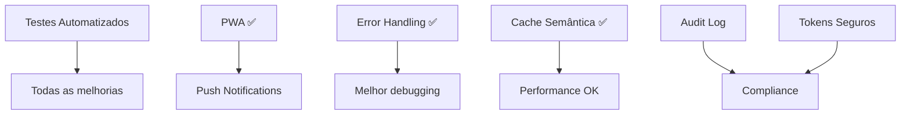

# 📋 MELHORIAS RESTANTES - PLANO DE IMPLEMENTAÇÃO DEFINITIVO

> **Projeto:** Gifts Store  
> **Análise atualizada em:** 27/12/2025 (16:30)  
> **Metodologia:** Varredura exaustiva do código-fonte + verificação linha a linha  
> **Revisor:** Claude AI (Análise Perfeccionista)

---

## 📊 RESUMO EXECUTIVO ATUALIZADO

| Status | Quantidade |
|--------|------------|
| ✅ Já Implementado | **21 funcionalidades** |
| 🔴 Pendente - Alta Prioridade | **6 melhorias** |
| 🟡 Pendente - Média Prioridade | **10 melhorias** |
| 🟢 Pendente - Baixa Prioridade | **8 melhorias** |
| **TOTAL PENDENTE** | **24 melhorias** |

---

## ✅ FUNCIONALIDADES JÁ IMPLEMENTADAS (Verificado em 27/12/2025 16:30)

| # | Funcionalidade | Arquivo(s) | Status |
|---|----------------|---------|--------|
| 1 | ✅ PWA (Progressive Web App) | `public/manifest.json`, `public/sw.js`, `src/lib/sw-register.ts` | COMPLETO |
| 2 | ✅ Lazy Loading de Rotas | `src/App.tsx` (linhas 19-68 usam React.lazy) | COMPLETO |
| 3 | ✅ Rate Limiting Edge Functions | `supabase/functions/_shared/rate-limiter.ts` | COMPLETO |
| 4 | ✅ Exportação Excel Genérica | `src/utils/excelExport.ts`, `src/components/export/ExportExcelButton.tsx` | COMPLETO |
| 5 | ✅ Sistema de Gamificação | `src/hooks/useGamification.ts`, `src/components/gamification/*` | COMPLETO |
| 6 | ✅ Onboarding Interativo | `src/hooks/useOnboarding.ts`, `src/components/onboarding/*` | COMPLETO |
| 7 | ✅ Loja de Recompensas | `src/hooks/useRewardsStore.ts`, `src/pages/RewardsStorePage.tsx` | COMPLETO |
| 8 | ✅ Metas de Vendas | `src/hooks/useSalesGoals.ts`, `src/components/goals/SalesGoalsCard.tsx` | COMPLETO |
| 9 | ✅ Follow-up Reminders | `src/hooks/useFollowUpReminders.ts`, `src/components/reminders/*` | COMPLETO |
| 10 | ✅ Chat IA Especialista | `src/hooks/useExpertConversations.ts`, `src/components/expert/*` | COMPLETO |
| 11 | ✅ Busca Visual por Imagem | `src/components/search/VisualSearchButton.tsx`, `supabase/functions/visual-search/*` | COMPLETO |
| 12 | ✅ Busca por Voz | `src/hooks/useSpeechRecognition.ts`, `src/components/search/VoiceSearchOverlay.tsx` | COMPLETO |
| 13 | ✅ QR Code para Orçamentos | `src/components/quotes/QuoteQRCode.tsx` | COMPLETO |
| 14 | ✅ Tags/Etiquetas | `src/components/quotes/TagManager.tsx` | COMPLETO |
| 15 | ✅ Modo Apresentação | `src/components/products/PresentationMode.tsx` | COMPLETO |
| 16 | ✅ Minhas Recompensas | `src/components/gamification/MyRewards.tsx` | COMPLETO |
| 17 | ✅ Loja de Recompensas (UI) | `src/components/gamification/RewardsStore.tsx` | COMPLETO |
| 18 | ✅ Configuração Locale pt-BR | `src/lib/locale-config.ts`, `src/lib/date-utils.ts` | COMPLETO |
| 19 | ✅ **Cache de Busca Semântica** | `supabase/functions/semantic-search/index.ts` (TTLCache com Map, 5min TTL, 1000 entries LRU) | COMPLETO |
| 20 | ✅ **Error Handling Centralizado** | `src/components/errors/ErrorBoundary.tsx`, `src/hooks/useErrorHandler.ts` | COMPLETO |
| 21 | ✅ **ErrorBoundary Global** | `src/App.tsx` (linha 91 envolve toda aplicação) | COMPLETO |

---

## 🔴 PENDENTES ALTA PRIORIDADE (6 itens)

### 1. Testes Automatizados
**Status:** ❌ NÃO IMPLEMENTADO  
**Evidência:** Nenhum arquivo `*.test.ts`, `*.spec.ts` ou `vitest.config.ts` encontrado  
**Impacto:** Risco de regressão em refatorações, qualidade de código comprometida  
**Tempo Estimado:** 2-3 dias

**Arquivos a criar:**
```
vitest.config.ts
src/test/setup.ts
src/hooks/__tests__/useGamification.test.ts
src/hooks/__tests__/useQuotes.test.ts
src/hooks/__tests__/useSalesGoals.test.ts
src/hooks/__tests__/useErrorHandler.test.ts
src/components/__tests__/QuoteKanbanBoard.test.tsx
src/components/__tests__/ErrorBoundary.test.tsx
.github/workflows/test.yml
```

**Tarefas Detalhadas:**
1. ❑ Instalar dependências: `vitest`, `@testing-library/react`, `@testing-library/user-event`, `jsdom`
2. ❑ Configurar `vitest.config.ts` com environment jsdom
3. ❑ Criar `src/test/setup.ts` para configurações globais
4. ❑ Escrever testes unitários para hooks críticos
5. ❑ Escrever testes de componente para UI crítica
6. ❑ Configurar CI no GitHub Actions
7. ❑ Atingir cobertura mínima de 30%

---

### 2. Tokens de Aprovação Mais Seguros
**Status:** ⚠️ PARCIAL  
**Evidência:** `supabase/functions/quote-approval/index.ts` usa UUID simples  
**Impacto:** Vulnerabilidade a força bruta, token válido por 7 dias  
**Tempo Estimado:** 4-5 horas

**Arquivos a editar:**
```
supabase/functions/quote-approval/index.ts
src/hooks/useQuoteApproval.ts
+ Migration: ALTER TABLE quote_approval_tokens
```

**Tarefas Detalhadas:**
1. ❑ Migrar de UUID para tokens com `crypto.randomBytes(32)`
2. ❑ Reduzir validade de 7 dias para 48 horas
3. ❑ Aplicar rate limiter existente (5 req/min por token)
4. ❑ Registrar IP e user-agent nas aprovações
5. ❑ Invalidar token imediatamente após uso único
6. ❑ Adicionar audit log de tentativas

---

### 3. Validação de Formulários Completa
**Status:** ⚠️ PARCIAL  
**Evidência:** Zod instalado mas schemas incompletos  
**Impacto:** Dados inválidos podem ser enviados ao backend  
**Tempo Estimado:** 4-6 horas

**Arquivos a criar/editar:**
```
src/lib/validations/quoteSchema.ts
src/lib/validations/authSchema.ts
src/lib/validations/profileSchema.ts
src/lib/validations/goalSchema.ts
src/lib/validations/reminderSchema.ts
src/lib/validations/index.ts
src/pages/QuoteBuilderPage.tsx (integrar)
src/pages/Auth.tsx (integrar)
src/pages/ProfilePage.tsx (integrar)
```

**Tarefas Detalhadas:**
1. ❑ Auditar todos os formulários existentes
2. ❑ Criar schemas Zod centralizados em `src/lib/validations/`
3. ❑ Integrar com react-hook-form
4. ❑ Mensagens de erro claras em pt-BR
5. ❑ Validar campos obrigatórios antes de submit
6. ❑ Validar formatos (email, telefone, CPF/CNPJ)

---

### 4. Notificações Push Web
**Status:** ❌ NÃO IMPLEMENTADO  
**Evidência:** Service Worker tem handler mas não há subscription  
**Impacto:** Usuário não recebe alertas fora do app  
**Tempo Estimado:** 8-10 horas  
**Dependência:** PWA (✅ já implementado)

**Arquivos a criar:**
```
src/hooks/usePushNotifications.ts
supabase/functions/send-push/index.ts
+ Migration: CREATE TABLE push_subscriptions
```

**Tarefas Detalhadas:**
1. ❑ Implementar Web Push API no frontend
2. ❑ Criar hook `usePushNotifications`
3. ❑ Solicitar permissão do navegador
4. ❑ Salvar subscription no banco (endpoint, keys)
5. ❑ Criar edge function para envio de push
6. ❑ Triggers para: orçamento aprovado, lembrete vencido, conquista

---

### 5. Audit Log Universal
**Status:** ⚠️ PARCIAL  
**Evidência:** Apenas `quote_history` e `order_history` existem  
**Impacto:** Auditoria incompleta, compliance problemático  
**Tempo Estimado:** 6-8 horas

**Arquivos a criar:**
```
+ Migration: CREATE TABLE audit_log + triggers
src/components/admin/AuditLogViewer.tsx
src/hooks/useAuditLog.ts
```

**Tarefas Detalhadas:**
1. ❑ Criar tabela `audit_log` universal
2. ❑ Criar triggers automáticos para tabelas críticas:
   - `products`, `quotes`, `orders`, `bitrix_clients`
3. ❑ Registrar: tabela, ação (INSERT/UPDATE/DELETE), valores antigos/novos, user_id, IP, timestamp
4. ❑ Criar visualização de audit log no admin
5. ❑ Filtros por data, usuário, tabela, ação
6. ❑ Exportação do audit log

---

### 6. Sincronização Bitrix24 Assíncrona
**Status:** ❌ NÃO IMPLEMENTADO  
**Evidência:** `supabase/functions/bitrix-sync/index.ts` é síncrono, pode travar  
**Impacto:** Usuário esperando muito tempo, timeouts frequentes  
**Tempo Estimado:** 1-2 dias

**Arquivos a editar:**
```
supabase/functions/bitrix-sync/index.ts
src/hooks/useBitrixSync.ts
src/pages/BitrixSyncPage.tsx
```

**Tarefas Detalhadas:**
1. ❑ Transformar sync em job assíncrono
2. ❑ Criar fila de processamento por páginas
3. ❑ Progress bar em tempo real via Realtime
4. ❑ Notificar quando concluído
5. ❑ Retry automático em falhas (3x)
6. ❑ Log detalhado de erros por registro

---

## 🟡 PENDENTES MÉDIA PRIORIDADE (10 itens)

### 7. Duplicar Orçamento
**Status:** ❌ NÃO IMPLEMENTADO  
**Evidência:** Não há função de duplicação no hook ou UI  
**Tempo Estimado:** 2-3 horas

**Arquivos a editar:**
```
src/hooks/useQuotes.ts (adicionar duplicateQuote)
src/pages/QuoteViewPage.tsx (adicionar botão)
src/pages/QuotesListPage.tsx (adicionar ação)
```

**Tarefas:**
1. ❑ Criar função `duplicateQuote(quoteId)` no hook
2. ❑ Copiar todos os itens e personalizações
3. ❑ Gerar novo número de orçamento
4. ❑ Definir status como "draft"
5. ❑ Adicionar botão na visualização e lista

---

### 8. Comentários em Orçamentos
**Status:** ❌ NÃO IMPLEMENTADO  
**Evidência:** Apenas notas internas, sem thread de comentários  
**Tempo Estimado:** 4-6 horas

**Arquivos a criar:**
```
+ Migration: CREATE TABLE quote_comments
src/components/quotes/QuoteComments.tsx
src/hooks/useQuoteComments.ts
```

**Tarefas:**
1. ❑ Criar tabela `quote_comments` com RLS
2. ❑ Componente de thread de comentários
3. ❑ Notificar quando novo comentário
4. ❑ Mencionar outros vendedores (@user)

---

### 9. Bulk Actions (Ações em Massa)
**Status:** ❌ NÃO IMPLEMENTADO  
**Evidência:** Nenhum arquivo relacionado a seleção múltipla  
**Tempo Estimado:** 6-8 horas

**Arquivos a criar:**
```
src/components/common/BulkActionsBar.tsx
src/hooks/useBulkSelection.ts
```

**Tarefas:**
1. ❑ Criar hook para gerenciar seleção
2. ❑ Checkbox de seleção em listas
3. ❑ Barra flutuante de ações quando itens selecionados
4. ❑ Ações: Excluir, Alterar Status, Exportar
5. ❑ Aplicar em: Orçamentos, Pedidos, Clientes

---

### 10. Filtros Salvos por Usuário
**Status:** ❌ NÃO IMPLEMENTADO  
**Evidência:** `FilterPresets.ts` existe mas é estático  
**Tempo Estimado:** 4-5 horas

**Arquivos a criar/editar:**
```
+ Migration: CREATE TABLE user_filter_presets
src/hooks/useFilterPresets.ts (editar para usar banco)
src/components/filters/SavedFiltersDropdown.tsx
```

**Tarefas:**
1. ❑ Criar tabela `user_filter_presets`
2. ❑ Salvar filtros no banco por usuário
3. ❑ Restaurar ao carregar a página
4. ❑ Opção de "Limpar filtros salvos"

---

### 11. Histórico de Preços de Produtos
**Status:** ❌ NÃO IMPLEMENTADO  
**Evidência:** Apenas preço atual é armazenado  
**Tempo Estimado:** 4-6 horas

**Arquivos a criar:**
```
+ Migration: CREATE TABLE product_price_history + trigger
src/components/products/PriceHistoryChart.tsx
```

**Tarefas:**
1. ❑ Criar tabela `product_price_history`
2. ❑ Trigger para registrar mudanças de preço
3. ❑ Componente de gráfico de histórico
4. ❑ Exibir no ProductDetail

---

### 12. Dashboard Bitrix Sync Melhorado
**Status:** ⚠️ PARCIAL  
**Evidência:** `BitrixSyncPage.tsx` existe mas sem status em tempo real  
**Tempo Estimado:** 4-6 horas

**Arquivos a editar:**
```
src/pages/BitrixSyncPage.tsx
src/hooks/useBitrixSync.ts
```

**Tarefas:**
1. ❑ Status de sync em tempo real via Realtime
2. ❑ Exibir última sincronização
3. ❑ Mostrar erros recentes
4. ❑ Log de atividades

---

### 13. Versionamento de Orçamentos
**Status:** ❌ NÃO IMPLEMENTADO  
**Evidência:** Editar orçamento sobrescreve original  
**Tempo Estimado:** 8-10 horas

**Arquivos a criar/editar:**
```
+ Migration: ADD COLUMN version INTEGER, parent_quote_id UUID
src/hooks/useQuoteVersions.ts
src/components/quotes/QuoteVersionHistory.tsx
```

**Tarefas:**
1. ❑ Adicionar campos `version` e `parent_quote_id`
2. ❑ Criar nova versão ao editar orçamento enviado
3. ❑ Histórico de versões
4. ❑ Comparar versões lado a lado

---

### 14. Importação CSV de Produtos
**Status:** ❌ NÃO IMPLEMENTADO  
**Evidência:** Produtos só via webhook/API  
**Tempo Estimado:** 6-8 horas

**Arquivos a criar:**
```
src/components/admin/ProductImportCSV.tsx
supabase/functions/import-products/index.ts
```

**Tarefas:**
1. ❑ Upload de arquivo CSV
2. ❑ Validar e preview dos dados
3. ❑ Importar com feedback de progresso
4. ❑ Log de erros por linha

---

### 15. Integração Google Calendar
**Status:** ❌ NÃO IMPLEMENTADO  
**Evidência:** Lembretes só no sistema  
**Tempo Estimado:** 6-8 horas

**Arquivos a criar:**
```
src/hooks/useGoogleCalendar.ts
supabase/functions/google-calendar/index.ts
```

**Tarefas:**
1. ❑ OAuth com Google
2. ❑ Sincronizar lembretes de follow-up
3. ❑ Criar eventos no calendário do usuário

---

### 16. Dashboard Personalizável
**Status:** ❌ NÃO IMPLEMENTADO  
**Evidência:** Dashboard BI fixo  
**Tempo Estimado:** 1 dia

**Arquivos a criar:**
```
+ Migration: CREATE TABLE user_dashboard_layouts
src/components/dashboard/DraggableWidget.tsx
src/hooks/useDashboardLayout.ts
```

**Tarefas:**
1. ❑ Widgets arrastáveis com dnd-kit
2. ❑ Salvar layout por usuário
3. ❑ Adicionar/remover widgets

---

## 🟢 PENDENTES BAIXA PRIORIDADE (8 itens)

### 17. Relatórios Agendados
**Tempo Estimado:** 1 dia

**Tarefas:**
1. ❑ Agendar envio de relatório por email
2. ❑ Escolher frequência (diário, semanal, mensal)
3. ❑ Edge Function para gerar e enviar

---

### 18. Temas White-label
**Tempo Estimado:** 1 semana

**Tarefas:**
1. ❑ Variáveis CSS dinâmicas
2. ❑ Upload de logo customizado
3. ❑ Paleta de cores por cliente

---

### 19. Integração WhatsApp Business
**Tempo Estimado:** 1 semana

**Tarefas:**
1. ❑ API WhatsApp Business
2. ❑ Enviar orçamentos via WhatsApp
3. ❑ Notificações de status

---

### 20. Fine-tuning de Modelo IA
**Tempo Estimado:** 2-4 semanas

**Tarefas:**
1. ❑ Coletar dados de treinamento
2. ❑ Fine-tune para domínio de brindes
3. ❑ Deploy de modelo customizado

---

### 21. Marketplace de Integrações
**Tempo Estimado:** 2-3 meses

**Tarefas:**
1. ❑ Arquitetura de plugins
2. ❑ API de integrações
3. ❑ Documentação para desenvolvedores

---

### 22. API Pública Documentada
**Tempo Estimado:** 2-3 semanas

**Tarefas:**
1. ❑ OpenAPI/Swagger spec
2. ❑ Autenticação por API Key
3. ❑ Rate limiting por cliente
4. ❑ Documentação interativa

---

### 23. App Mobile Nativo
**Tempo Estimado:** 2-3 meses

**Tarefas:**
1. ❑ React Native ou Flutter
2. ❑ Push notifications nativas
3. ❑ Offline-first com sync
4. ❑ Publicar nas lojas

---

### 24. Multi-tenancy
**Tempo Estimado:** 1-2 meses

**Tarefas:**
1. ❑ Arquitetura multi-tenant
2. ❑ Isolamento de dados por empresa
3. ❑ Configurações por tenant

---

## 📅 CRONOGRAMA SUGERIDO (8 SEMANAS)

### Semana 1-2: Fundamentos
| Item | Prioridade | Tempo |
|------|------------|-------|
| Testes Automatizados (setup + hooks críticos) | 🔴 Alta | 3 dias |
| Validação de Formulários | 🔴 Alta | 1 dia |

### Semana 3-4: Segurança
| Item | Prioridade | Tempo |
|------|------------|-------|
| Tokens de Aprovação Seguros | 🔴 Alta | 1 dia |
| Audit Log Universal | 🔴 Alta | 1 dia |
| Notificações Push Web | 🔴 Alta | 2 dias |

### Semana 5-6: UX e Produtividade
| Item | Prioridade | Tempo |
|------|------------|-------|
| Duplicar Orçamento | 🟡 Média | 0.5 dia |
| Bulk Actions | 🟡 Média | 1 dia |
| Filtros Salvos | 🟡 Média | 0.5 dia |
| Comentários em Orçamentos | 🟡 Média | 1 dia |

### Semana 7-8: Integrações e Melhorias
| Item | Prioridade | Tempo |
|------|------------|-------|
| Sincronização Bitrix Assíncrona | 🔴 Alta | 2 dias |
| Versionamento de Orçamentos | 🟡 Média | 1 dia |
| Dashboard Bitrix Melhorado | 🟡 Média | 1 dia |

---

## 📊 MÉTRICAS DE SUCESSO

| Métrica | Meta |
|---------|------|
| Cobertura de Testes | > 30% |
| Tempo de Resposta Cache | < 50ms hit |
| Token Expiration | 48h (atual 7d) |
| Audit Log Coverage | 100% tabelas críticas |
| Uptime Push Notifications | > 99% |
| Taxa de Erros Capturados | 100% (ErrorBoundary) |

---

## 🔗 DEPENDÊNCIAS ENTRE MELHORIAS



---

## ✍️ NOTAS FINAIS

1. **Priorizar Testes** - Sem testes, todas as outras melhorias têm risco de regressão
2. **Segurança Primeiro** - Tokens e Audit Log são críticos para produção
3. **UX Incremental** - Melhorias de UX podem ser feitas em paralelo
4. **Documentar Tudo** - Cada melhoria deve ter documentação atualizada

---

*Documento gerado automaticamente por análise de código em 27/12/2025 16:30*
